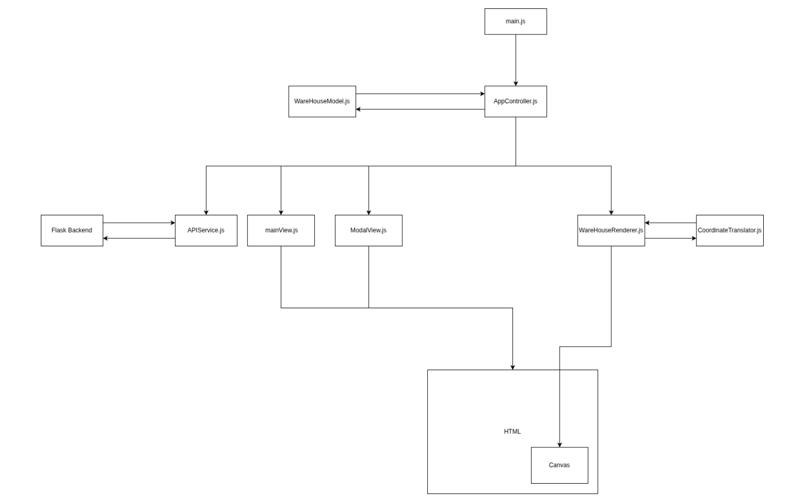

# Travelling Salesman Problem in Warehouse Networks

This repository contains the implementation of a flask app that allows users to generate warehouse router solving 
problems by generating random locations the travelling salesman must visit. For comparison there are 3 algorithms the 
User can choose from to solve the problem:

1. Nearest Neighbour Algorithm (Heuristical Approach)
2. Christofides Algorithm (3/2-approximation algorithm)
3. Steiner TSP Dynamic Programming Approach (Hadrien Cambazard and Nicolas Catusse)

Todo add Sceenshots of the frontend here

## Installation and setup
Todo 

## Algorithms implemented
## Features and Usage 
## Thesis context and results

## Overall Code Architecture

### Frontend JavaScript Architecture

The frontend is split into the following models:
- main.js: Calls the AppController
- AppController.js: Main controller that handles user input and communicates with the backend
    - **_handleFloorPlanChange()**: fetches the new floor plan from the main view updates the model and pases the new layout to the renderer
    - **_handleGenerateLocations()**: fetches the api call to generate new random locations from the flask backend via the ApiService and draws them via the Renderer
    - **_handleCalculateRoute()**: fetches the api call via the ApiService model and renders the routes via the renderer
- CoordinateTranslator.js: Translates the coordinates from the backend onto the canvas 
  - **update()**: recalculates all the pixel to coordinate relationships based on the current warehouse layout and canvas size
  - **gridToPixel()**: translates grid coordinates to pixel coordinates
  - **getPackingTablePixelRect()**: calculates the position for the packing tables and returns their coordinates in pixel values
- domUtils.js: Contains helper functions for DOM manipulation
  - **addLocationToTable()**: adds a new location to the location table in the UI
  - **updateRouteInfoTable()**: updates the location table with new locations
- mainView.js: Manages the main view of the application
  - **getFloorPlanConfig()**: a getter for the layout configuration of the warehouse
  - **getLocationCount()**: a getter for the number of locations
  - **clearData()**: clears all the data from the view
  - **renderLocations()**: renders the generated locations on the canvas
  - **showError()**: displays error messages to the user
  - **bindChangeFloorPlan()**: Todo understand binds the floor plan change event to the controller
  - **bindGenerateLocations()**: Todo understand binds the generate locations button to the controller
  - **bindCalculateRoute()**: Todo understand binds the calculate route button to the controller
  - **getSelectedAlgorithm()**: Todo understand retrieves the selected algorithm from the UI
- ModalView.js: manages the comparison modal view
  - **show()**: displays the modal and draws the canvases 
  - **hide()**: hides the modal
  - **_bindEventListeners()**: defines the event listeners for the modal buttons
- WareHouseModel.js: represents the warehouse model
  - **updateDimensions()**: updates the warehouse layout based on user input
  - **setStockLocations()**: generates random locations within the warehouse layout
  - **setRoutes()**: sets the calculated routes for the warehouse
  - **getConfigForAPI()**: prepares the warehouse configuration for API calls

### Backend Python Architecture

## Technologies Used

The following technologies were used in the development of this project:
- Python
- Flask
- HTML/CSS/JavaScript for the frontend
- python libraries: heapq, math, abc, collections, pytest, random, time
- canvas

## License and Contact
Author: Constantin Dietrich

E-Mail: constantindietrich@hotmail.de
