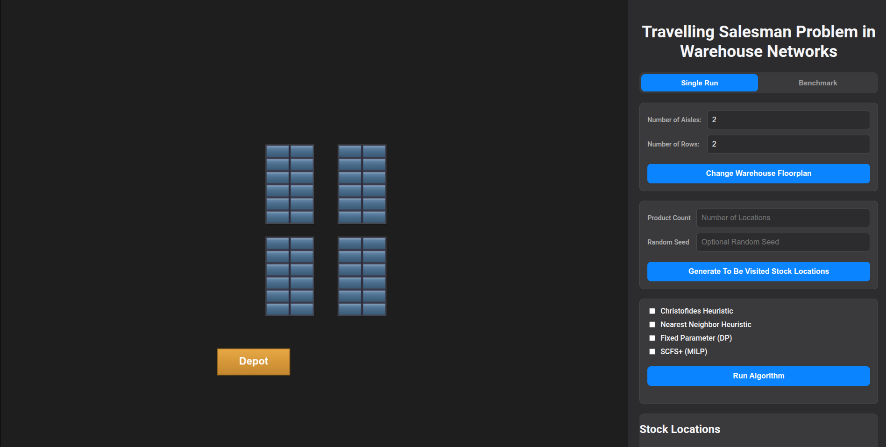
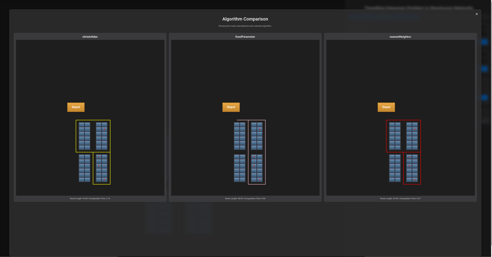

# Order Picking Routing Problem — Algorithm Comparison

A Flask web application that models a rectangular warehouse as a graph and compares three
algorithms for the **Order Picking Routing Problem (OPRP)**: a heuristic, an approximation
algorithm with a proven guarantee, and an exact fixed-parameter algorithm. Routes are
visualised on an interactive warehouse grid, and a built-in benchmarking endpoint runs
full-factorial parameter sweeps under reproducible conditions.

Built as part of my bachelor thesis in Computer Science at the Chair of Algorithms and Data
Structures, University of Freiburg.





## The problem

The OPRP is a generalisation of the TSP: a picker starts at the depot, visits a given set of
storage locations and returns. Only the pick locations *must* be visited — all other nodes of
the warehouse graph may be traversed freely. This makes it a Steiner-TSP variant on a
rectilinear grid rather than a plain TSP.

Two size parameters matter and are varied independently in the benchmarks: the **order size**
(number of locations to visit) and the **warehouse dimensions** (number of shelf columns and
shelf rows `r`). The number of cross aisles is `h = r + 1`.

## Algorithms

| Algorithm | Paradigm | Complexity | Gap B1 | Gap B2 | Gap B3 |
|---|---|---|---|---|---|
| Nearest Neighbor | Heuristic | Θ(n²) | 4.05 % | 11.60 % | 13.66 % |
| Christofides | 3/2-approximation | O(n³) | 3.56 % | 7.51 % | 7.93 % |
| Fixed Parameter | Exact, parameterised | O(h · v · 7^h) | 0 % | 0 % | 0 % |

Mean deviation from the optimum over 10,200 benchmark runs. B1 varies the warehouse width at
`r = 1`, B2 varies the shelf rows at width 10, B3 varies both simultaneously. The gap columns
cover only the configuration levels on which the fixed-parameter algorithm terminates without
exception (1080, 840 and 760 instances) — above those levels the surviving instances are
selection-biased and no exact reference exists.

Worst observed cases: Nearest Neighbor 35.71 % / 44.36 % / 50.00 %, Christofides
15.79 % / 23.53 % / 24.24 %. The 3/2 bound was therefore never approached.

Mean computation times: Nearest Neighbor below 2 ms throughout, Christofides 5–6 ms, and the
fixed-parameter algorithm from 3.6 ms at `r = 1` to 53.0 s at `r = 7`. From `r = 8` most runs
exceed the 90 s limit — 658 of the 10,200 runs ended in a timeout.

**Nearest Neighbor** always moves to the closest unvisited location. Fast, but without a
constant approximation guarantee: for metric instances the ratio to the optimal tour grows as
Θ(log n).

**Christofides** builds a minimum spanning tree, computes a minimum-weight perfect matching on
the odd-degree vertices (Blossom algorithm via NetworkX), and shortcuts the resulting Eulerian
circuit into a Hamiltonian tour. Guarantees at most 1.5× the optimum for metric TSP. In this
implementation the bottleneck is not the matching but building the edge weights, which
dominates the runtime for large orders.

**Fixed Parameter** implements the dynamic programme of Cambazard & Catusse. It sweeps the
warehouse column by column and carries a *frontier state* — one parity per cross aisle plus a
connected-component label — so the state count depends only on `h`, not on the warehouse width.
The number of reachable states is `|Ω(h)| = Σ_k C(h,k) · S_k` with the little Schröder numbers
`S_k`, because the component partition is non-crossing. A dominance rule keeps only the
cheapest partial solution per state. The sweep graph is built only up to the topmost and
rightmost pick, so the *effective* `h` depends on the instance, not just on the layout. This is
why some runs still terminate at `r ≥ 8`.

> **Note on `routes/scfs_plus.py`:** the repository also contains an MILP formulation
> (SCFS+, solved with PuLP/CBC). It was used during development, is **not** part of the thesis
> and was not executed in any benchmark. The `PuLP` dependency and part of the test suite
> exist because of it.

## Running with Docker

This is the reproducible path and requires nothing but Docker. The build and run commands are
also repeated as comments at the end of the `Dockerfile`, ready to copy after a
`cat Dockerfile`.

```bash
docker build -t oprp-bench .
docker run --rm -p 127.0.0.1:5000:5000 oprp-bench
```

The application is then available at `http://localhost:5000`. On start the container prints
what else it can do, so no prior knowledge of this README is needed. The image is based on
`python:3.12-slim` (Python 3.12.13) and installs the pinned versions from `requirements.txt`
and `requirements-dev.txt`.

### Everything the container can do: `make help`

Every task has a Makefile target. `make` without arguments lists them and states, for each
one, which files it reads, which files it produces, roughly how long it takes and roughly how
much RAM and disk space it needs:

```bash
docker run --rm oprp-bench make help
```

| Target | What it does | Duration |
|---|---|---|
| `make app` | start the web application | until interrupted |
| `make test` | run the test suite (126 tests) | seconds |
| `make verify` | check the fixed-parameter algorithm against Held-Karp (182 instances) | seconds |
| `make b1` | benchmark B1, width 1 to 10 at `r = 1` | under a minute |
| `make b2` | benchmark B2, shelf rows 1 to 10 at width 10 | about 11 hours |
| `make b3` | benchmark B3, square layouts 1x1 to 10x10 | about 10 hours |
| `make bench-all` | B1, B2 and B3 in sequence | about 21 hours |
| `make clean` | remove `__pycache__/` and `.pytest_cache/` | seconds |

Benchmark output goes to `benchmarks/results/` by default and can be redirected with
`BENCH_OUT_DIR`, which is how the results reach a mounted host volume:

```bash
mkdir -p results
docker run --rm -v "$PWD/results:/data" oprp-bench make b1 BENCH_OUT_DIR=/data
```

Targets never overwrite an existing CSV — they append, so an interrupted run only costs the
stage in progress.

## Running the benchmarks

The web UI covers interactive use. For measurement runs, `POST` a configuration to the
`/benchmark` endpoint and fetch the results as CSV from `/benchmark/export`. A minimal
self-contained example:

```bash
curl -s -X POST http://127.0.0.1:5000/benchmark \
     -H 'Content-Type: application/json' \
     -d '{"warehouse_configs":[{"numColumns":5,"numCrossings":1}],
          "product_counts":[5,10],
          "iterations":20,
          "base_seed":42,
          "timeout_seconds":90,
          "algorithms":["nearestNeighbor","christofides","fixedParameter"]}'

curl -s http://127.0.0.1:5000/benchmark/export -o results.csv
```

Payload fields: `warehouse_configs` is the list of layouts to sweep, `product_counts` the order
sizes, `iterations` the repetitions per combination, `base_seed` the seed of the first
iteration, and `timeout_seconds` the per-solver wall-clock limit.

> **Careful with `numCrossings`:** despite the name, the field holds the number of **shelf
> rows** `r`. The number of cross aisles is `h = r + 1`. A layout with `numCrossings: 1` has two
> cross aisles.

Each solver runs in a capped subprocess with a hard timeout and a 12 GB address-space limit.
The memory limit never took effect in the recorded runs — the time limit always triggered
first. The CSV holds one row per run with algorithm, layout, product count, iteration, route
length, computation time, seed and status.

### Reproducing the three thesis benchmarks

The payloads of the three benchmarks are in `benchmarks/payloads/`: `b1.json` varies the
warehouse width at `r = 1`, `b2.json` varies the shelf rows at width 10, and `b3.json` varies
both at once. All three use 20 iterations, `base_seed: 42` and a 90 s timeout.

Two runners are shipped. The reported measurements were produced with **`bench_night_runner.py`**,
which runs the same loops as the endpoint but calls the solvers directly, without the HTTP
layer. It writes after every configuration and calls `fsync`, so an interrupted run only loses
the stage in progress, and a second call appends to the existing file:

```bash
docker run --rm -v "$PWD/results:/data" oprp-bench make b1 BENCH_OUT_DIR=/data
```

`make b1` is a thin wrapper around `python bench_night_runner.py b1`, so calling the runner
directly works just as well. Both directories can be redirected with the environment variables
`BENCH_PAYLOAD_DIR` and `BENCH_OUT_DIR`; without Docker, the defaults already point at the
directories in this repository.

Verified end to end: a fresh `docker run --rm -v ... oprp-bench make b1 BENCH_OUT_DIR=/data`
reproduces all 3240 rows of the B1 data set used in the thesis with zero deviations in route
length or status.

**`benchmarks/run_bench_http.sh`** takes the other path: it posts a payload to a running
instance, converts the response to CSV and writes a log. It needs the application to be up
(see above):

```bash
benchmarks/run_bench_http.sh b1
```

Expect roughly half a minute for B1, about eleven hours for B2 and about ten for B3 on a
current laptop — the fixed-parameter algorithm dominates as soon as `r` grows.

Each measurement is preceded by a discarded warm-up run of the same solver on a tiny instance.
Without it every measurement would include the one-off interpreter initialisation, since each
run is executed in its own forked process: roughly 1.6 ms per run, and only for Christofides
and the fixed-parameter algorithm, which are the two solvers that use NetworkX. The measured
span itself runs from instantiating the solver until the closed tour and its length are
available; expanding that tour into a walkable cell sequence serves the visualisation only and
lies outside the measurement.

## Validation

```bash
make verify   # 182/182 instances: FixedParameter == optimum
make test     # 126 tests
```

`verify_optimality.py` deterministically generates 182 random instances with up to 5 shelf
columns, 3 shelf rows and 10 products, and checks for each whether the fixed-parameter
algorithm hits the optimum of an independent Held-Karp reference solver. The bound on instance
size comes from the exponential cost of that reference. Both commands also run inside the
container.

The warehouse distance formula, on which every reported route length depends, is checked
against two independent controls: an exhaustive breadth-first search over all 1,015,039
location pairs of seven layouts between 1x1 and 10x8, and the A* implementation in
`algorithms/a_star.py`. A* is no longer part of the application — the drawn path is built by a
closed-form three-segment construction — and now serves only as the search-based reference in
the test suite.

## Local installation without Docker

```bash
git clone https://github.com/ConstiCode/bachelor_thesis.git
cd bachelor_thesis
python -m venv .venv
source .venv/bin/activate
pip install -r requirements.txt -r requirements-dev.txt
python app.py
```

## Repository layout

Where to find what.

| Path | Contents |
|---|---|
| `Makefile` | every task with its inputs, outputs, runtime and memory footprint — start here |
| `Dockerfile` | container definition; the build and run commands are the comments at the end |
| `docker-entrypoint.sh` | prints the usage notice on container start, then runs the given command |
| `app.py` | Flask entry point, solver registry, `/benchmark` driver, CSV export |
| `routes/` | the three solvers plus `scfs_plus.py`, all inheriting from `BaseRoute` |
| `warehouse/grid.py` | warehouse model and the constant-time distance formula |
| `algorithms/a_star.py` | A* pathfinding, now only the search-based reference in the tests |
| `utils/` | shared helpers |
| `tests/` | pytest suite, 126 tests |
| `verify_optimality.py` | optimality check of the fixed-parameter algorithm against Held-Karp |
| `bench_night_runner.py` | the runner that produced the measurements reported in the thesis |
| `benchmarks/payloads/` | `b1.json`, `b2.json`, `b3.json` — the three benchmark configurations |
| `benchmarks/results/` | default output directory for the benchmark CSVs (redirect with `BENCH_OUT_DIR`) |
| `benchmarks/run_bench_http.sh` | alternative runner going through the HTTP endpoint |
| `benchmark_path_construction.py` | micro-benchmark of the closed-form path construction |
| `templates/`, `static/` | frontend; the JavaScript modules live in `static/js/` |
| `ASTAR_ERSATZ.md` | why A* was replaced by the closed-form construction in the drawn path |

The written thesis itself lives in a separate repository
([bachelor-thesis-tex](https://github.com/ConstiCode/bachelor-thesis-tex)). The benchmark CSVs
this repository produces are the data behind the tables and plots there.

## Architecture

### Backend (Python/Flask)

- `app.py` — Flask entry point, solver registry, benchmark driver and CSV export
- `routes/` — solver classes inheriting from the abstract `BaseRoute`
  - `nearest_neighbor.py`, `christofides.py`, `fixed_parameter.py`, `scfs_plus.py`
- `warehouse/grid.py` — warehouse grid model with constant-time distance calculation
- `algorithms/a_star.py` — A* pathfinding, used to turn a visit sequence into a walkable path
- `verify_optimality.py` — optimality check against the Held-Karp reference solver

### Frontend (vanilla JavaScript)

MVC-style architecture with ES6 modules, no external libraries:

- `AppController.js` — coordinates user input, API calls and rendering
- `WarehouseRenderer.js` — canvas-based warehouse grid visualisation
- `ModalView.js` — side-by-side algorithm comparison
- `CoordinateTranslator.js` — grid-to-pixel coordinate mapping

## Technologies

- **Flask** — web framework and REST API
- **NetworkX** — graph operations (Blossom matching, Eulerian circuit)
- **PuLP** — MILP modelling with CBC, used only by `scfs_plus.py`
- **pytest** — testing

## Author

GitHub: [ConstiCode](https://github.com/ConstiCode)
